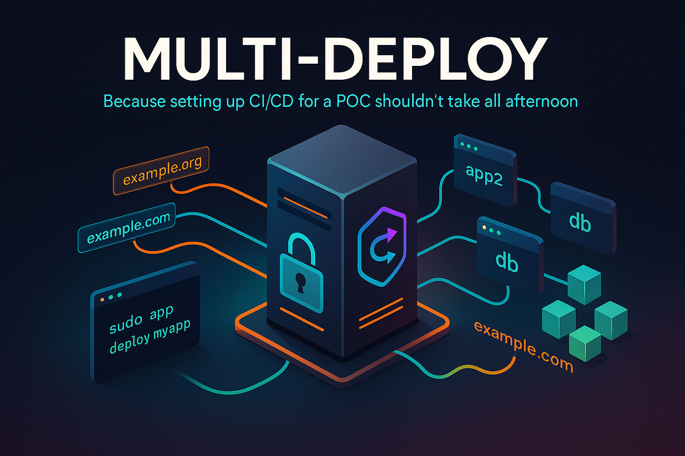

# Multi Deploy

🚀 **Deploy multiple Docker Compose apps effortlessly on a single Ubuntu server**

Perfect for rapid prototyping, staging environments, and cost-effective hosting without complex CI/CD infrastructure. While designed for experiments and staging, it can be used for production but it's not recommended.

## Why Multi Deploy?

**💡 The Problem:** Setting up individual hosting, CI/CD pipelines, and SSL certificates for every experiment or staging app is expensive and time-consuming. Why reinvent the wheel every time?

**✅ The Solution:** One server, one setup, unlimited apps with automatic HTTPS and deployments.

### Key Benefits

- **🏗️ Quick Experiments** — Deploy any Docker Compose app in under 5 minutes
- **💰 Cost Effective** — Host multiple apps on one server instead of paying for separate hosting/serverless
- **🔒 Automatic HTTPS** — Let's Encrypt certificates managed automatically via Traefik
- **🔄 Auto-Deploy** — Git-based deployments without webhooks or complex CI/CD
- **🛠️ Simple Management** — Powerful CLI for app lifecycle and debugging
- **📦 No Vendor Lock-in** — Standard Docker Compose, runs anywhere

### Perfect For

- **Staging environments** for multiple projects
- **Personal projects** and side experiments  
- **Small team demos** and proof-of-concepts
- **Development previews** from feature branches
- **Simple production apps** (where scaling is not needed)

### How It Works

- **One Traefik instance** handles reverse proxy and SSL for all apps
- **Each app** lives in its own Git repo with a standard Docker Compose file
- **Systemd timers** poll for changes and auto-deploy (no webhooks needed)
- **Simple CLI** manages everything: create, deploy, debug, monitor

## 🚀 Quick Start

### 1. One-Line Setup

Run on a fresh Ubuntu 22.04+ server as root, or to update an existing installation:

```bash
bash -c "$(curl -fsSL https://raw.githubusercontent.com/r-Larch/multi-deploy/refs/heads/master/setup.sh)"
```

The installer will:

- Install Docker (if missing)
- Download this repository into `/opt/multi-deploy`
- Ask for your Let's Encrypt email for Traefik and start Traefik on ports 80/443
- Install systemd units for auto-deploy timers
- Add `/opt/multi-deploy/bin` to PATH (new shells)

### 2. Create Your First App

```bash
# Interactively create a new app from any Docker Compose repo (private SSH repos supported)
sudo app create myapp https://github.com/user/my-compose-repo.git
# The setup will show you a deploy key if using SSH - add it to your repo's settings
# The create command helps you prepare a compose override file so you can make adjustments,
# like configuring your production app to run in a staging environment

# Configure or override the Traefik router and middleware for your app
# (if not already configured in your repo)
labels:
  - "traefik.enable=true"
  # You can also add just this line to override the domain if your repo already has valid Traefik config
  - "traefik.http.routers.myapp.rule=Host(`myapp-domain.com`)" 
  - "traefik.http.routers.myapp.entrypoints=websecure"
  - "traefik.http.routers.myapp.tls.certresolver=letsencrypt"

# After configuring, deploy:
sudo app deploy myapp
# Your app is now live at https://myapp-domain.com

# (Optional) Enable auto-deployment (polls every minute for changes)
sudo app timers myapp on

# Manual deployment (pull latest changes and deploy):
sudo app update myapp
```

**What happens behind the scenes:**

- Repo cloned to `/opt/multi-deploy/apps/myapp/code`
- Generated `compose.yml` uses `include:` to include your repo's compose files + Traefik config
- Systemd timer starts polling for git changes and auto-deploying

### 3. That's It

Your app automatically deploys on git pushes. No webhooks, no CI/CD setup required.

## App Management

The `app` command provides everything you need to manage your deployments:

### Essential Commands

```bash
# List all apps and their status
sudo app list

# Get detailed info about an app (shows services, containers, git status)
sudo app detail myapp

# View logs (last 50 lines, follows by default)
sudo app logs myapp

# Manual deployment (useful for testing)
sudo app deploy myapp

# Start/stop/restart services
sudo app up myapp
sudo app down myapp  
sudo app restart myapp

# Access running containers
sudo app shell myapp [service-name]    # Interactive shell
sudo app run myapp [service-name] command  # Run one-off commands

# Git operations (useful for branch deployments)
sudo app pull myapp                    # Pull latest changes
sudo app git myapp status             # Check git status  
sudo app git myapp switch feature-branch  # Deploy a different branch
```

### Timer Management

```bash
# View auto-deploy status for an app
sudo app timers myapp

# Control auto-deployment
sudo app timers myapp on   # Start auto-deployment timer
sudo app timers myapp off  # Stop auto-deployment (app keeps running)

# Complete removal
sudo app delete myapp    # Stops services, removes files, disables timer
```

## 🔧 Troubleshooting

Having issues? The `app` command has built-in debugging tools to help you identify problems quickly.

### Check Overall Health

```bash
# See all apps and their current status
sudo app list

# Get detailed information about a specific app
sudo app detail myapp
# Shows: git status, running containers, service states, recent deployments
```

### Debug Deployment Issues

```bash
# Check if auto-deployment is working
sudo app timers myapp

# Manually trigger deployment to see errors
sudo app deploy myapp

# Check git status for your app
sudo app git myapp status
# Verify repo is clean and on the right branch

# Switch to a different branch if needed
sudo app git myapp switch main
```

### Debug Runtime Issues

```bash
# Check if containers are running
sudo app list

# View real-time logs
sudo app logs myapp
# Add service name for specific container: sudo app logs myapp web

# Check the merged compose config:
sudo app detail myapp

# Access container for debugging
sudo app shell myapp web

# Or run specific commands:
sudo app run myapp ls   # same as: docker compose -f <app-compose-file> ls
sudo app run myapp kill # same as: docker compose -f <app-compose-file> kill

# Restart if containers are stuck
sudo app restart myapp
```

### Common Issues

**App not accessible from web:**

- Check Traefik labels in your `compose.yml` or `compose.server.yml`
- Verify domain DNS points to your server
- Enable and Check Traefik dashboard eg. `https://traefik.yourdomain.com`

**Deployment not happening automatically:**

- Run `sudo app timers` to verify timer is enabled
- Check timer logs: `journalctl -u multi-deploy@myapp.timer`
- Verify git repo is accessible and has changes

**Container won't start:**

- Check logs: `sudo app logs myapp`  
- Try manual deployment: `sudo app deploy myapp`
- Access container for debugging: `sudo app shell myapp service-name`

**Permission issues:**

- All `app` commands should be run with `sudo`
- Check file ownership in `/opt/multi-deploy/apps/myapp/`

## Architecture Overview

### Directory Structure

```text
/opt/multi-deploy/
├── bin/           # CLI tools (app, app-compose, app-git, app-deploy)
├── apps/          # Your deployed applications
│   └── myapp/
│       ├── code/          # Your git repo
│       ├── compose.yml    # Generated compose file
│       ├── compose.server.yml  # Traefik configuration
│       └── app.env        # App-specific environment
├── traefik/       # Traefik reverse proxy config
└── etc/systemd/   # Systemd timer templates
```

### How Auto-Deployment Works

1. **Systemd timer** (every minute) runs `watch-and-deploy.sh`
2. **Git check:** Fetch latest commits from origin
3. **Change detection:** Compare local vs remote branch  
4. **Build & deploy:** If changes found, run `docker compose build --pull && up -d`
5. **Logging:** All output saved to `/opt/multi-deploy/apps/<name>/deploy.log` (rotated weekly)

### Networking

- **External network `web`:** Shared between all apps for Traefik routing
- **Traefik:** Handles SSL termination, routing, and Let's Encrypt certificates
- **Per-app networks:** Each app gets isolated internal networking via Docker Compose

## Advanced Usage

### Custom Compose Files

Your app repo can contain:

- `compose.yml` or `docker-compose.yml` - Main application definition
- Multi-deploy will include both files when building the final stack

### Environment Variables

Set app-specific variables in `/opt/multi-deploy/apps/<name>/app.env`:

```bash
# Edit app environment
sudo nano /opt/multi-deploy/apps/myapp/app.env

# Restart to apply changes
sudo app restart myapp
```

### Branch Deployments

Deploy different branches for staging/testing:

```bash
# Switch to feature branch
sudo app git myapp switch feature-xyz

# Deploy the branch
sudo app deploy myapp

# Switch back to main when done
sudo app git myapp switch main
```

### Traefik Dashboard

Enable the Traefik dashboard for monitoring and debugging your reverse proxy:

```bash
# Navigate to Traefik directory
cd /opt/multi-deploy/traefik

# Edit the environment file
sudo nano .env
```

Update the dashboard settings:

```bash
TRAEFIK_DASHBOARD_ENABLE=true
TRAEFIK_DASHBOARD_HOST=my-domain.com
```

Create dashboard user credentials:

```bash
# Add a user to the dashboard (replace with your username/password)
echo "$(htpasswd -nb myusername MyPassw0rd123)" | sudo tee -a dashboard_users

# Restart Traefik to apply changes
sudo docker compose restart
```

Your Traefik dashboard will be available at `https://my-domain.com` with basic authentication using the credentials you created.

### Manual Deployments

Disable auto-deployment for manual control:

```bash
# Stop auto-deployment but keep app running
sudo app timers myapp off

# Deploy manually when ready
sudo app deploy myapp
```

## 📚 Complete CLI Reference

### Main Commands

- **`create`** - Interactive setup wizard for new apps
- **`list`** - List all apps with status (running containers, auto-deploy state)
- **`detail <name> [service]`** - Detailed app info: git status, services, containers
- **`delete <name>`** - Remove app completely (stops containers, deletes files)
- **`timers <name>`** - Show auto-deploy status for an app
- **`timers <name> on`** - Start auto-deployment timer (polls every minute)
- **`timers <name> off`** - Stop auto-deployment timer (app keeps running)

### Deployment Commands

- **`deploy <name>`** - Manual deployment: build and restart containers
- **`up <name>`** - Start all services with `docker compose up -d`
- **`down <name>`** - Stop all services with `docker compose down`
- **`restart <name>`** - Restart all services

### Debugging Commands

- **`logs <name> [service]`** - View logs (follows by default, last 200 lines)
- **`shell <name> <service>`** - Open interactive shell in running container
- **`run <name> <service> command`** - Run one-off command in service container

### Git Commands

All git operations maintain app context and work within the app's code directory:

- **`pull <name>`** - Git fetch + hard reset to origin/branch
- **`git <name> status`** - Show git status (branch, commits ahead/behind)
- **`git <name> fetch`** - Fetch latest commits
- **`git <name> pull`** - Fetch + hard reset to origin/branch  
- **`git <name> reset-hard`** - Hard reset to origin/branch
- **`git <name> switch <branch>`** - Switch and track origin/branch

### Usage Examples

```bash
# Quick health check
sudo app list
sudo app detail myapp

# Manage deployments
sudo app timers myapp on      # Start auto-deployment
sudo app deploy myapp          # Manual deployment
sudo app timers myapp off     # Stop auto-deployment

# Debug issues
sudo app logs myapp web        # View specific service logs
sudo app shell myapp web       # Access container shell
sudo app git myapp status      # Check git state

# Branch deployments
sudo app git myapp switch staging  # Deploy staging branch
sudo app deploy myapp              # Deploy the new branch
sudo app git myapp switch main     # Back to main branch
```

## Requirements & Compatibility

- **OS:** Ubuntu 22.04+ (other Debian-based distros may work)
- **Memory:** 2GB+ recommended (depends on your apps)
- **Storage:** 20GB+ for system + your app containers and logs
- **Network:** Public IP with ports 80/443 accessible
- **Domain:** DNS pointing to your server for automatic HTTPS

### Git Access

- **Public repos:** HTTPS or SSH both work fine
- **Private repos:** SSH recommended (setup generates SSH key automatically)
- **SSH setup:** Ensure your shell has ssh-agent and key loaded if needed:

  ```bash
  eval "$(ssh-agent -s)"
  ssh-add /root/.ssh/id_ed25519
  ```

### Docker Compose Tips

- Don't publish ports on app services; Traefik connects over the shared `web` network
- In `compose.server.yml`, only the web service needs `traefik.enable=true` and to join the `web` network
- Put additional Traefik labels in your app repo compose files if needed (middlewares, routers, etc.)

## Contributing & Support

This project is designed for simplicity and experimentation. Contributions welcome!

- **Issues:** Report bugs or request features via GitHub Issues
- **Pull Requests:** Improvements to scripts, documentation, or examples
- **Community:** Share your multi-deploy setups and use cases

Remember: This tool prioritizes simplicity over complexity. It's perfect for experiments and staging, but evaluate carefully for production workloads requiring high availability or complex orchestration.
